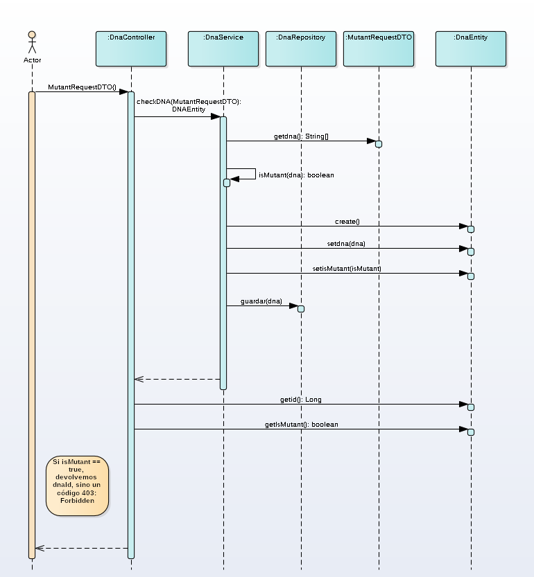
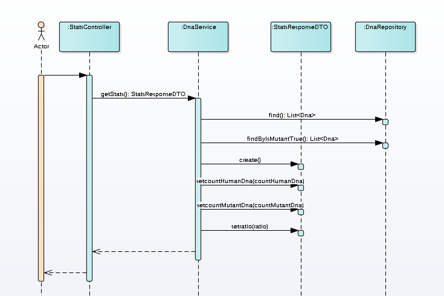
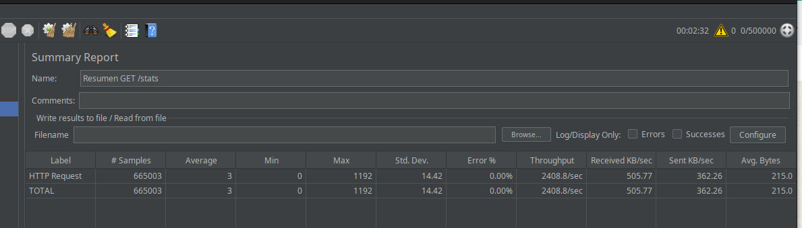
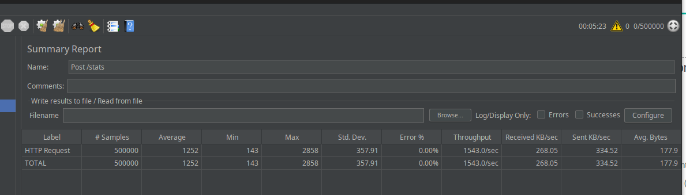
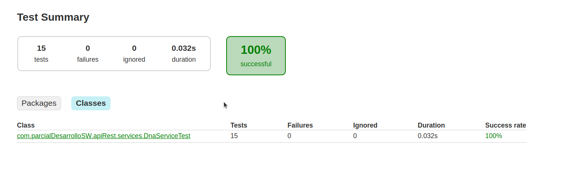

# Desafíos Magneto Mutante

Este proyecto implementa una API REST en Spring Boot para detectar mutantes a partir de secuencias de ADN. La solución incluye una base de datos PostgreSQL para almacenar verificaciones.

## Desafíos

### Nivel 1
Programa en JAVA que cumpla con el método pedido por Magneto
### Nivel 2
API REST para detectar mutantes, deployada en [https://parcial1dsw.onrender.com](https://parcial1dsw.onrender.com).
- **Endpoint**: `/mutant/`
- **Método**: `POST`
- **Formato del body**:
  ```json
  { "dna": ["ATGCGA", "CAGTGC", "TTATGT", "AGAAGG", "CCCCTA", "TCACTG"] }
### Nivel 3
Expande la API con almacenamiento en base de datos y un endpoint para estadísticas.

- **Endpoint**: `/stats`
- **Método**: `GET`
- **Formato de respuesta**:
  ```json
  {
    "count_mutant_dna": 40,
    "count_human_dna": 100,
    "ratio": 0.4
  }
### Diagramas de Secuencia tanto para el nivel 2 como el 3

#### Diagrama de Secuencia - Nivel 2


#### Diagrama de Secuencia - Nivel 3


### Pruebas de Estrés con JMeter
#### GET /stats


#### POST /mutant

En este último caso, la conexión a la base de datos fue rechazada en un momento pero el programa no se cayó.
### Reporte de Pruebas Unitarias al Servicio que detecta si un DNA es mutante o no
